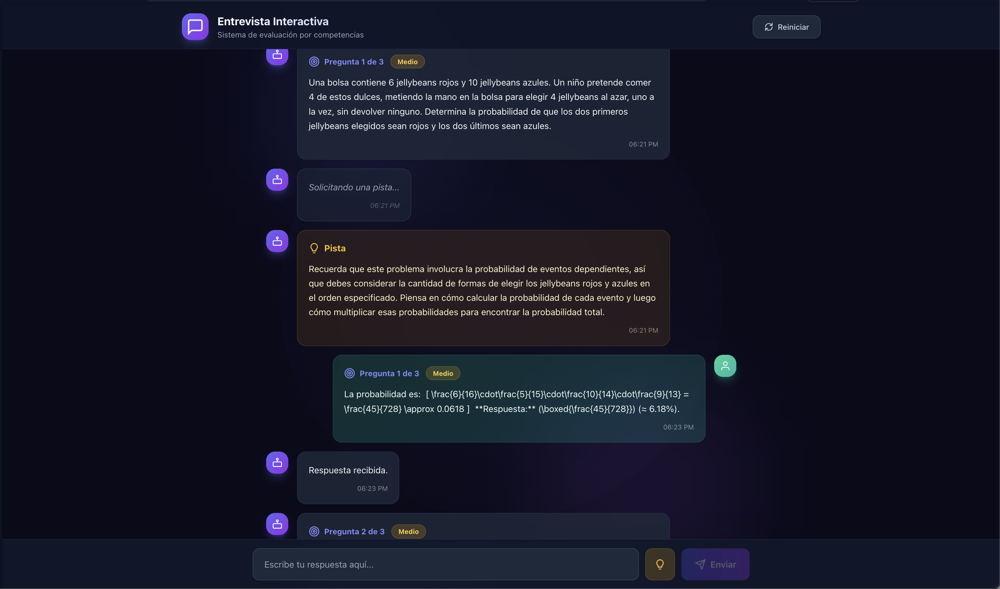
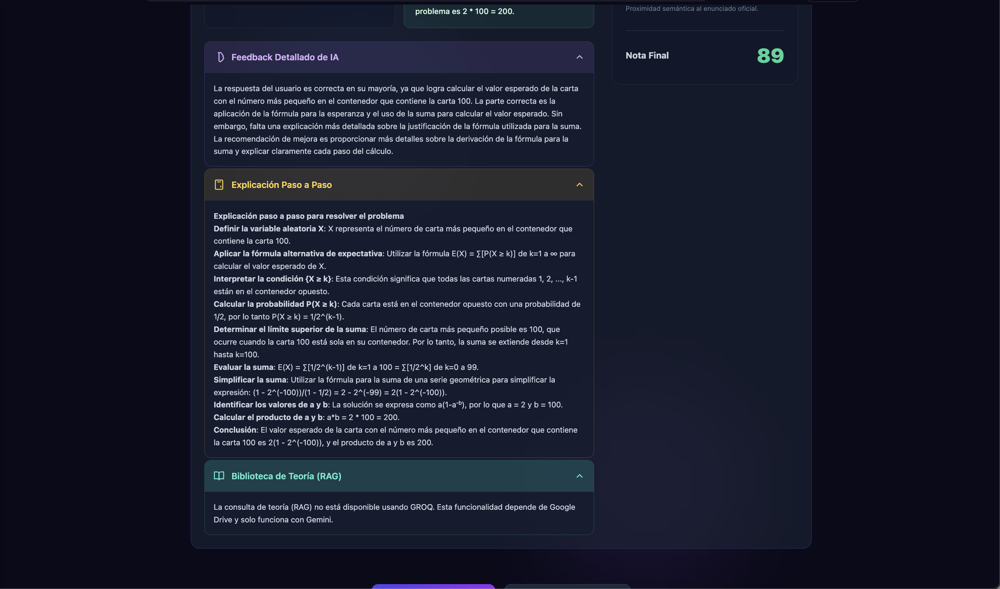
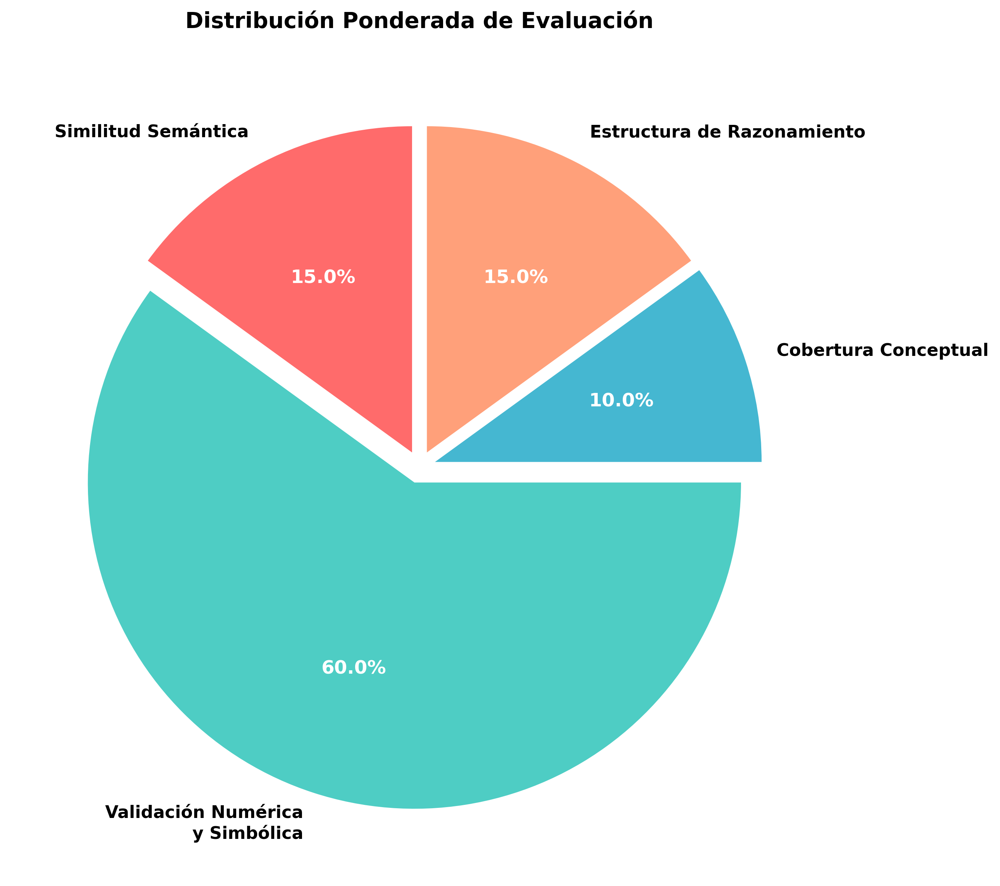
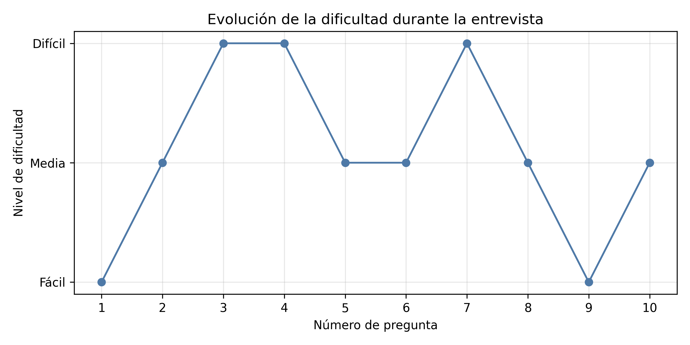
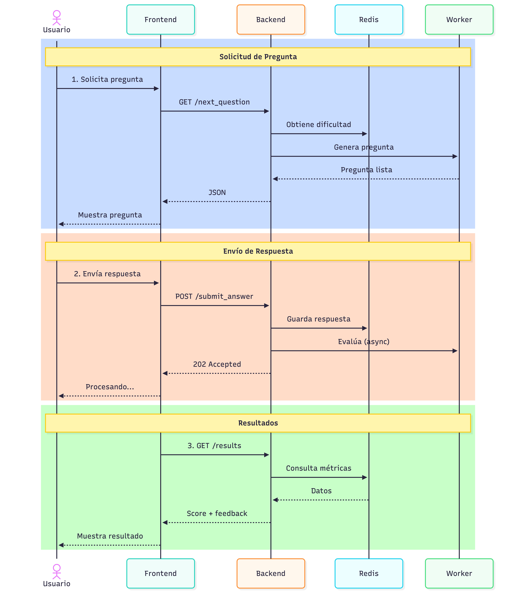
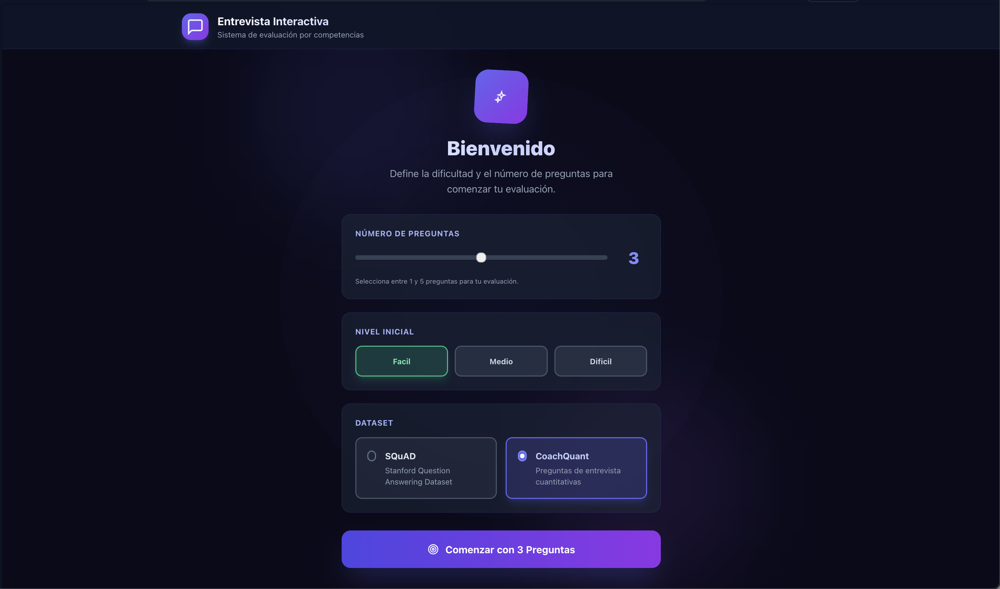

# Interview Generator — Evaluación de entrevistas técnicas con LLMs

> Simulador de entrevistas que **genera preguntas con un LLM**, **corrige la respuesta con métricas de PLN** y **ajusta la dificultad en tiempo real** según cómo lo esté haciendo el usuario.


<p align="center">
  
  &nbsp;
  
  <br>
  <em>Izquierda: entrevista en curso, con pistas bajo demanda. Derecha: informe final con el análisis de la IA.</em>
</p>

## Qué es

La mayoría de sistemas de preguntas y respuestas se limitan a comparar tu texto con la solución. **Interview Generator** descompone cada respuesta en cuatro dimensiones medibles, calcula una nota global y usa esa nota para decidir **qué pregunta te toca después**.

El resultado es un entorno de práctica que se adapta: si dominas el tema, sube de nivel; si te atascas, baja y refuerza.

| Pieza | Qué hace |
|---|---|
| **Generación (RAG)** | Recupera contexto de una base vectorial (ChromaDB) y pide al LLM que formule la pregunta al nivel de dificultad actual. |
| **Evaluación híbrida** | Cuatro métricas de PLN combinadas en una nota 0–1: semántica, numérica, conceptual y de razonamiento. |
| **Dificultad adaptativa** | Lógica de rachas sobre la nota global: promociona con el acierto, refuerza con el fallo. |
| **Retroalimentación** | Comparativa, crítica del LLM, solución paso a paso (Chain-of-Thought) y fundamentación teórica sobre bibliografía real. |

## Evaluación híbrida

Cada respuesta se puntúa en cuatro dimensiones y se combinan con pesos fijos ([`evaluator.py`](src/project/metrics/evaluator.py)):

| Dimensión | Peso | Cómo se calcula |
|---|:--:|---|
| **Validación numérica** | **0.60** | `SymPy` + expresiones regulares. Comprueba el resultado con tolerancia al redondeo. |
| **Similitud semántica** | 0.15 | Embeddings `Sentence-BERT` (`all-mpnet-base-v2`). Acepta sinónimos y redacciones distintas. |
| **Estructura de razonamiento** | 0.15 | Heurísticas sobre conectores, pasos secuenciales y formalidad técnica. |
| **Cobertura conceptual** | 0.10 | `KeyBERT` + `spaCy`. Mide si aparecen los conceptos clave de la solución. |

<p align="center">
  
</p>

El peso dominante de la validación numérica es una decisión deliberada: comparar textos libres no distingue de forma fiable una respuesta correcta de una que *suena* correcta. Si el usuario llega al número bueno, debería aprobar. Las otras tres dimensiones matizan la nota, no la deciden.

## Dificultad adaptativa

La dificultad se mueve por **rachas**, no por la última pregunta ([`app.py`](src/project/app.py)):

- **Sube** tras **2 respuestas seguidas** con nota **≥ 0.85**.
- **Baja de inmediato** ante un fallo claro, con nota **< 0.45**.
- Cualquier otra cosa mantiene el nivel y **rompe la racha**.

Así se evitan los saltos bruscos que provocaba una única respuesta buena o mala.

<p align="center">
  
</p>

## Cómo funciona

Backend **FastAPI** con tres capas: frontend ligero (Jinja2 + JS), servicios de generación y evaluación, y **Redis** como almacén de estado de sesión.

El ciclo de vida de una pregunta:

1. El backend consulta la dificultad actual en Redis y pide una pregunta al **QuestionGenerator**, que recupera contexto de ChromaDB y lo normaliza con el LLM.
2. El usuario responde. La respuesta se guarda **al instante** y el análisis se delega a un **BackgroundTask** de FastAPI.
3. El **Evaluator** calcula las cuatro métricas en segundo plano (es la parte cara: 5–10 s) y actualiza Redis con el resultado. La interfaz no se bloquea.
4. Con la nota global se actualiza la racha y, si toca, el nivel de la siguiente pregunta.
5. Al terminar, se consolidan las métricas de la sesión en un informe por pregunta.

<p align="center">
  
</p>

## Puesta en marcha

**Requisitos:** Python 3.10–3.14 (3.15+ aún no lo soportan `torch`/`transformers`) y, opcionalmente, Redis. Sin Redis la app arranca igual, en modo degradado: memoria volátil y un solo worker.

```bash
git clone https://github.com/pabloChantada/TAPL.git
cd TAPL

python -m venv .venv
source .venv/bin/activate      # Windows: .venv\Scripts\activate
pip install -r requirements.txt
```

Crea un `.env` a partir de [`.env.example`](.env.example) con tu proveedor y tu clave:

```bash
LLM_PROVIDER="GEMINI"          # GEMINI | GROQ | DEEPSEEK
GEMINI_API_KEY="tu_clave"
THEORY_BOOKS="files/id_libro"  # solo para el módulo de teoría (RAG sobre PDFs)
```

Indexa los datasets en ChromaDB y arranca el servidor:

```bash
./scripts/load_db.sh           # construye data/chroma_db_* (tarda unos minutos)
./scripts/run_app.sh           # detecta Redis: 4 workers si lo hay, 1 si no
```

La interfaz queda en **http://localhost:8000**. Eliges número de preguntas y dificultad inicial, y a responder. Si te atascas, el botón de **pista** da contexto sin destripar la solución.

<p align="center">
  
</p>

## API

| Método | Endpoint | Para qué |
|---|---|---|
| `GET` | `/api/datasets` | Datasets disponibles (SQuAD, CoachQuant). |
| `POST` | `/api/interview/start` | Abre sesión: nº de preguntas, dificultad inicial, dataset. |
| `GET` | `/api/interview/question/{session_id}` | Siguiente pregunta, al nivel que toque. |
| `POST` | `/api/interview/answer` | Envía la respuesta; lanza la evaluación en segundo plano. |
| `POST` | `/api/interview/hint` | Pista contextual sin revelar la solución. |
| `POST` | `/api/feedback` | Crítica del LLM sobre la respuesta. |
| `POST` | `/api/explanation` | Solución paso a paso (Chain-of-Thought). |
| `POST` | `/api/theory` | Fundamentación teórica vía RAG sobre bibliografía (requiere Gemini). |
| `GET` | `/results/{session_id}` | Informe final de la sesión. |

## Estructura

```
data/                      coachquant_all.jsonl + archive.zip (SQuAD original)
docs/
  ├── books/               PDFs de bibliografía para el módulo de teoría
  ├── notes/               bitácora de desarrollo y fuentes consultadas
  └── report/              memoria: main.tex, main.bib, diagrams/, main.pdf
scripts/
  ├── run_app.sh           arranca uvicorn (detecta Redis)
  ├── load_db.sh           indexa los datasets en ChromaDB
  └── upload_books.py      sube docs/books/*.pdf a la API de Gemini
src/project/
  ├── app.py               FastAPI: endpoints, sesión y dificultad adaptativa
  ├── rag/                 generación de preguntas, ChromaDB y teoría (Gemini)
  ├── metrics/             evaluador híbrido, feedback y análisis de rendimiento
  └── templates/, static/  interfaz web (Jinja2 + CSS + JS)
```

## Datasets

- **SQuAD** (Stanford Question Answering Dataset) — preguntas de comprensión. Se descarga desde Hugging Face al indexar; `data/archive.zip` guarda además una copia del original v1.1.
- **CoachQuant** — preguntas de entrevista cuantitativa, obtenidas con un crawler propio en **Scrapy** y normalizadas a JSONL.

## Stack

**Backend:** FastAPI · Pydantic · Jinja2 · Redis · Uvicorn
**RAG:** LangChain · ChromaDB · Google GenAI SDK (Gemini) · Groq · DeepSeek
**PLN:** Sentence-Transformers · KeyBERT · spaCy · SymPy · BERTScore

## Memoria

El análisis completo, decisiones de diseño, modelos descartados (DialoGPT, Qwen, BERT multilingüe, Llama), el problema de latencia que llevó a las tareas en segundo plano y el trabajo futuro está en la memoria del proyecto: [**docs/report/main.pdf**](docs/report/main.pdf)

## Autor

**Pablo Chantada Saborido** — [pablochantadasaborido@gmail.com](mailto:pablochantadasaborido@gmail.com)
Técnicas Avanzadas de Procesamiento de Lenguaje Natural · Universidade da Coruña
